# Sensores Arduino

## 1. Planteamineto del problema
 - Reconocer e Implementar mediante la plataforma de TinkerCAD una serie de sensores para el arduino Uno e investigar sus diferentes usos, los cuales se pretende llevar a la práctica.

## 2. Objetivos
- **General**
  - Analizar los distintos sensores existentes para Arduino en tinkercad, sus características y tipos.
- **Específicos**
  - Identificar la función y uso específico de cada sensor.
  - Conocer los tipos de sensores existentes en el mercado y diferenciarlos entre sí.
  - Desarrollar ejemplos prácticos básicos para cada uno de los tipos de sensores analizados.

## 3. Estado del Arte
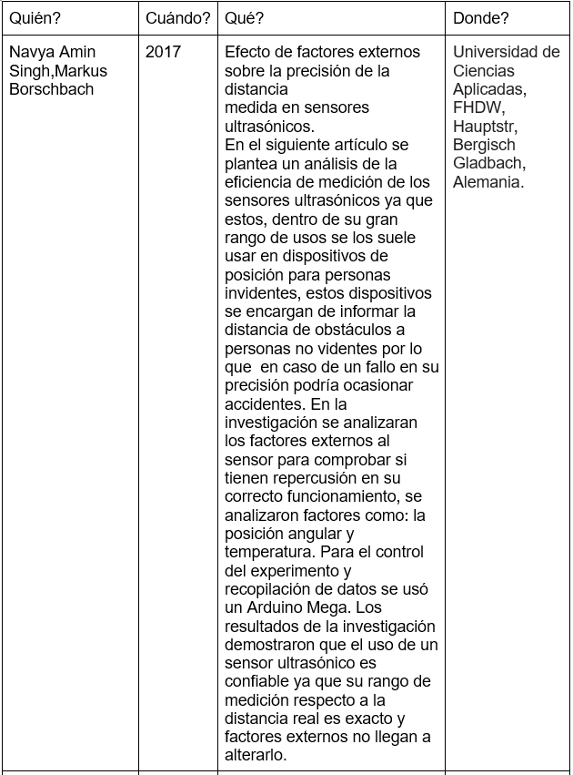

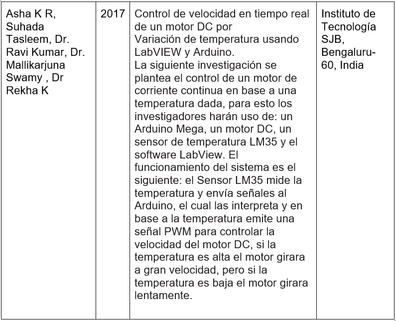

En lo que respecta a nuestro Investigación cada una de estas investigaciones tienen aportaciones generales como lo son:

 - Los sensores nos facilitan y ayudan en el desarrollo de temas como lo son la salud, seguridad e innovación, ya que nos permiten  desarrollar sistemas de automatización más eficientes.
 - El uso de Arduino no solo nos permite monitorear los sensores, sino darles una aplicación útil en conjunto con otros dispositivos.
 - Al contar con una infinidad de aspectos en nuestro entorno se puede también contar con una infinidad de sensores los cuales van a tener su control y configuración las cuales se adaptan fácilmente a nuestras necesidades.
 
## 4. Marco Teórico
Para poder entender con precisión el tema de  los sensores de Arduino existe un apartado teórico el cual nos servirá como guía y base para proceder con los diferentes proyectos que se desee realizar.
 
**¿Qué es un sensor?**

 Un sensor es un dispositivo capaz de detectar magnitudes físicas o químicas, llamadas variables de instrumentación, y transformarlas en variables eléctricas.

Un sensor es un dispositivo capaz de detectar magnitudes físicas o químicas, llamadas variables de instrumentación, y transformarlas en variables eléctricas.

Una magnitud eléctrica puede ser una resistencia eléctrica (como en una RTD), una capacidad eléctrica (como en un sensor de humedad o un sensor capacitivo), una tensión eléctrica (como en un termopar), una corriente eléctrica (como en un fototransistor), etc.
Existen diversos tipos de sensores, pero los antes mencionados si tienen una versión compatible con Arduino, siendo de gran utilidad dependiendo el proyecto en el que se quiera trabajar. 

Estos sensores se pueden clasificar en función de los datos de salida en:
- Digitales
- Analógicos

**Sensores Digitales**

Los sensores digitales son aquellos dispositivos que únicamente pueden adoptar valores de salida 1 y 0 que muchas veces representan un encendido y un apagado o un “si” y un “no”, los estados de un sensor digital son absolutos y únicos y por lo general se usa en situaciones donde se quiere verificar estados de “verdad” o “falsedad o negación”. 
También se debe considerar que en caso que el sensor use comunicación por bus, deberemos usar algunos de los buses que implementa Arduino o usar hardware adicional que nos proporcione un interfaz entre el Arduino y el bus.

**Sensores Analógico**

Los sensores analógicos son aquellos que como salida emiten una señal comprendida por un campo de valores instantáneos que varian en el tiempo y son proporcionales a los efectos que se están midiendo. 
Un ejemplo de un sensor analógico usado en la placa Arduino es el ACS714, es un sensor de efecto hall que mide las corrientes eléctricas que pasan a través del chip y devuelve un valor en voltaje proporcional a la corriente que circula por el sensor.

**Características de  los sensores**
**Rango de medida:** dominio en la magnitud medida en el que puede aplicarse el sensor.
**Precisión:** es el error de medida máximo esperado.

**Offset o desviación de cero:** valor de la variable de salida cuando la variable de entrada es nula. Si el rango de medida no llega a valores nulos de la variable de entrada, habitualmente se establece otro punto de referencia para definir el offset.

**Linealidad o correlación lineal**

**Sensibilidad de un sensor:** suponiendo que es de entrada a salida y la variación de la magnitud de entrada.

**Resolución:** mínima variación de la magnitud de entrada que puede detectarse a la salida.

**Rapidez de respuesta:** puede ser un tiempo fijo o depender de cuánto varíe la magnitud a medir. Depende de la capacidad del sistema para seguir las variaciones de la magnitud de entrada.

**Derivas:** son otras magnitudes, aparte de la medida como magnitud de entrada, que influyen en la variable de salida. Por ejemplo, pueden ser condiciones ambientales, como la humedad, la temperatura u otras como el envejecimiento (oxidación, desgaste, etc.) del sensor.

**Repetitividad:** es el error esperado al repetir varias veces la misma medida.

**Tipos de sensores utilizados**
 - Sensor de luz de ambiente

Es un sensor que nos va a permitir medir la luz en el entorno donde tengamos realizado nuestro montaje, de tal forma que podamos decidir qué acciones a realizar en función de los umbrales de luz u oscuridad que estimemos oportuno.  

Un ejemplo de este tipo de sensores es el LDR o fotoresistor.

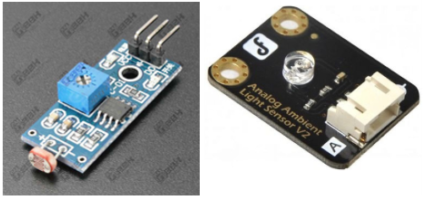

**Sensor PIR** 

Los sensores PIR se basan en la medición de la radiación infrarroja. Todos los cuerpos (vivos o no) emiten una cierta cantidad de energía infrarroja, mayor cuanto mayor es su temperatura. Los dispositivos PIR disponen de un sensor piro eléctrico capaz de captar esta radiación y convertirla en una señal eléctrica.
En realidad cada sensor está dividido en dos campos y se dispone de un circuito eléctrico que compensa ambas mediciones. Si ambos campos reciben la misma cantidad de infrarrojos la señal eléctrica resultante es nula. Por el contrario, si los dos campos realizan una medición diferente, se genera una señal eléctrica.
De esta forma, si un objeto atraviesa uno de los campos se genera una señal eléctrica diferencial, que es captada por el sensor, y se emite una señal digital, que es lo que realmente se ha de evidenciar al simular en Arduino.

**Sensor de distancia**

Un sensor de ultrasonidos, es un dispositivo para medir distancias. Su funcionamiento se basa en el envío de un pulso de alta frecuencia, no audible por el ser humano. Este pulso rebota en los objetos cercanos y es reflejado hacia el sensor, que dispone de un micrófono adecuado para esa frecuencia.
Midiendo el tiempo entre pulsos, conociendo la velocidad del sonido, podemos estimar la distancia del objeto contra cuya superficie impacto el impulso de ultrasonidos
Los sensores de ultrasonidos son sensores baratos, y sencillos de usar. El rango de medición teórico del sensor HC-SR04 es de 2cm a 400 cm, con una resolución de 0.3cm. En la práctica, sin embargo, el rango de medición real es mucho más limitado, en torno a 20cm a 2 metros.

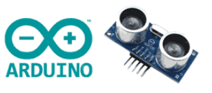

**Sensor de Inclinacion(TILT)**

Un sensor de inclinación es un dispositivo que proporciona una señal digital en caso de que su inclinación supere un umbral. Este tipo de sensor no permite saber el grado de inclinación del dispositivo, simplemente actúa como un sensor que se cierra a partir de una cierta inclinación.
En la actualidad, por motivos medioambientales, casi todos los sensores de mercurio han sido desplazados por sensores TILT de doble esfera. Se dispone de un cilindro cuya pared constituye un contacto eléctrico, mientras que el otro contacto está localizado en el centro de la base. Al inclinar lo suficiente el dispositivo ambas esferas constituyen un puente entre ambos contactos, cerrando el circuito.

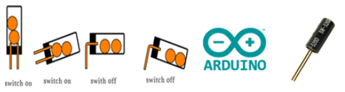

**Sensor de Temperatura**

Un sensor de temperatura es un componente que recoge la temperatura y/o humedad del exterior y lo transforma en señal digital o electrónica que envía a una placa electrónica como puede ser una placa Arduino. Existen muchos tipos de sensores y para muchos ámbitos.
En el caso del sensor TMP es un sensor de temperatura en grados centígrados de precisión y bajo voltaje

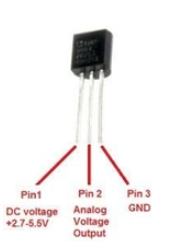

**Sensor de Gas**

Los sensores de gases MQ son una familia de dispositivos diseñados para detectar la presencia de distintos componentes químicos en el aire. Podemos conectar estos dispositivos a un autómata o procesador como Arduino.
Existe una gran variedad de sensores MQ. Cada modelo está diseñado para detectar una o más sustancias, pensadas para un uso específico, como por ejemplo detección gases inflamables, calidad del aire o detección de alcohol en aire respirado. Pueden proporcionar una salida de tipo analógico y de tipo digital, en este caso se usara una salida de tipo analógica.

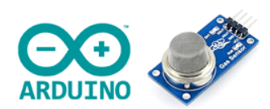

**Escalar sensores en Arduino**
Cuando entra un voltaje analógico en un pin analógico de Arduino, este hace la conversión de analógico a digital (ADC). Quiere decir que convierte el voltaje de entrada 0-5V en valores enteros comprendidos entre 0-1023. Para entender este valor, hay que saber que las entradas analógicas de Arduino son de 10 bits. Tal como sabemos, un bit puede ser 1 o 0 (dual). Con un nombre n de bits se pueden representar hasta 2nvalores digitales. En el caso de las entradas analógicas de Arduino:   210 = 1024 valores (de 0 a 1023)

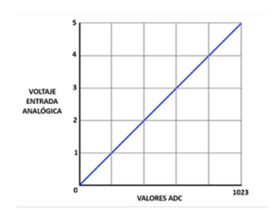

El siguiente paso es convertir estos valores nuevamente a voltaje en el código de Arduino. Para esto se tiene que multiplicar el valor leído del pin analógico por 5 (que son los 5V máximo que da el sensor) y dividirlo entre 1023 (que es el valor más grande dentro del rango de 10 bits). La fórmula sería la siguiente:

De este modo, tenemos relacionado el voltaje de salida del sensor con los valores digitales de Arduino.

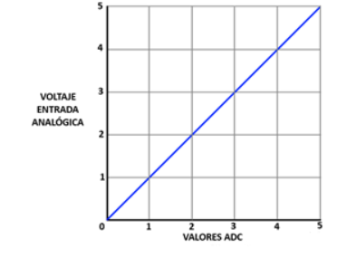

De esta manera podemos adecuar los valores de entrada analógica a los que realmente vayamos a necesitar interpretar en nuestro proyecto con sensores.

## 5.Diagramas
**Sensor PIR**
Para el siguiente sensor simularemos un circuito que en el momento que detecte movimiento a su alrededor encienda un led de color rojo que indique alerta, pero si no detecta movimiento pues se encendera un led de color verde.
El circuito contará con un sensor PIR  555-28027 el cual trabaja con las siguientes señales:

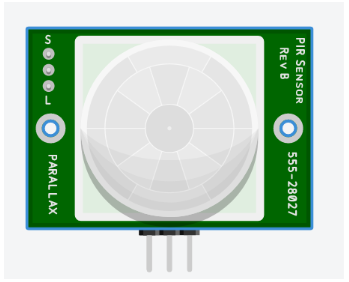

El pin de la derecha es para comunicarnos con el microcontrolador, en este caso arduino, el sensor usado trabaja con señales digitales por lo que si detecta movimiento en su rango de operación enviará un 1 lógico, caso contrario envía un 0 lógico.
El pin central es para la señal de alimentación, en este caso de 5v.
El pin de la derecha es para GND.

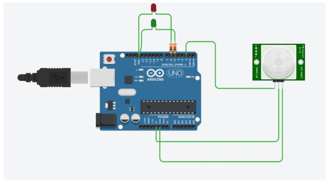

**Sensor de Inclinacion**
Simularemos un circuito que determine cuándo una superficie está inclinada en caso de estar inclinada se encenderá un led rojo, en caso de estar nivelada se encenderá un led verde.
El sensor a usar es el SW200D que funciona a manera de interruptor es decir se cierra o se abre dependiendo de la inclinación del sensor.

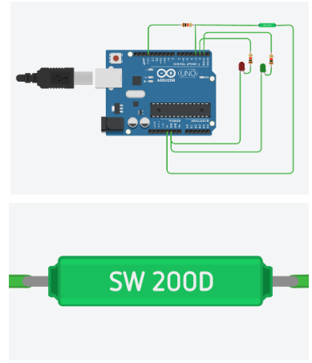

**Sensor de Gas**
En el siguiente circuito simularemos un detector de gas donde se tendra 3 niveles de peligro segun el nivel de gas en el ambiente, donde el encendido de un diodo rojo signifique peligro, amarillo alerta o precaucion y verde calma. Para este circuito se usará el sensor de gas predeterminado por tinkercad de 6 pines.

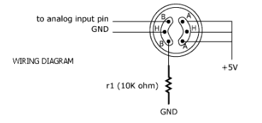

El circuito cuenta con 3 salidas correspondientes a los diodos y una entrada correspondiente al sensor el cual envía valores analogicos, por lo que usaremos uno de los pines analogicos de nuestro Arduino. También tendremos una resistencia para el sensor de 4,7k para protección del mismo además que de esta dependerá los valores para nuestro escalonamiento.

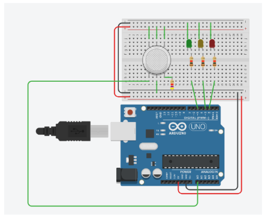

**Sensor de temperatura**
En el siguiente circuito se implemente un sensor de temperatura que va a encender cada led dependiendo de la temperatura que que detecte el sensor para c°<=15 Led azul, c°>=16 y c°<=29 Led verde, c°>=30 y c°<=49 Led amarillo, c°>=50 Led rojo
los valores ingresaran desde el sensor al arduino por la entrada analogica A1.

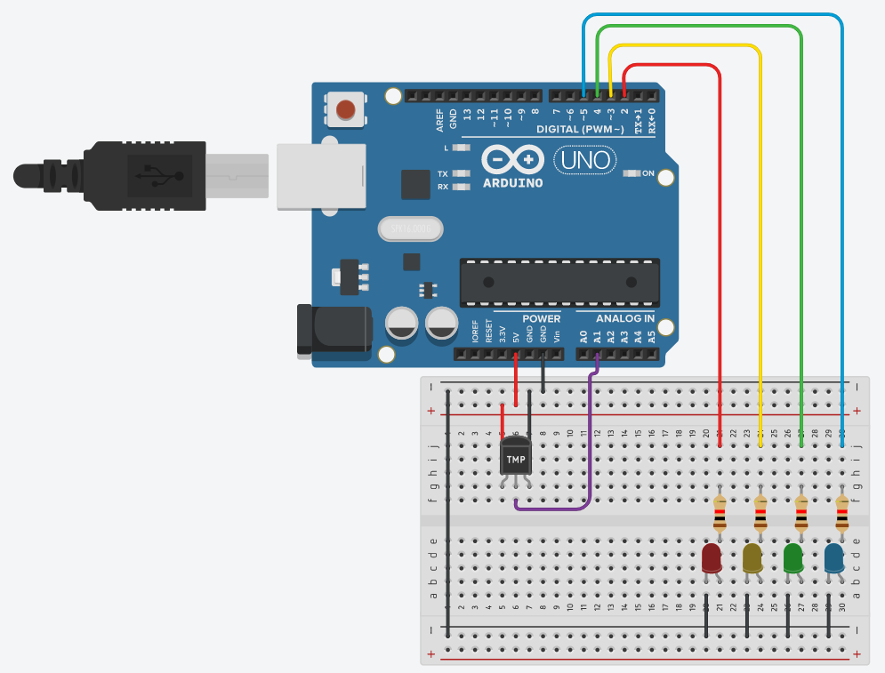

**Sensor de Luz de ambiente**
En el siguiente circuito se implemente un sensor de luz ambiente
que va a encender cada led dependiendo de la temperatura que que detecte el sensor para menor a val<=600 Led verde, val>=601 y val<=799 Led amarillo, val>=800 y val<=999 Led azul, val>=1000 Led blanco
los valores ingresarán desde el sensor al arduino por la entrada analogica A1.

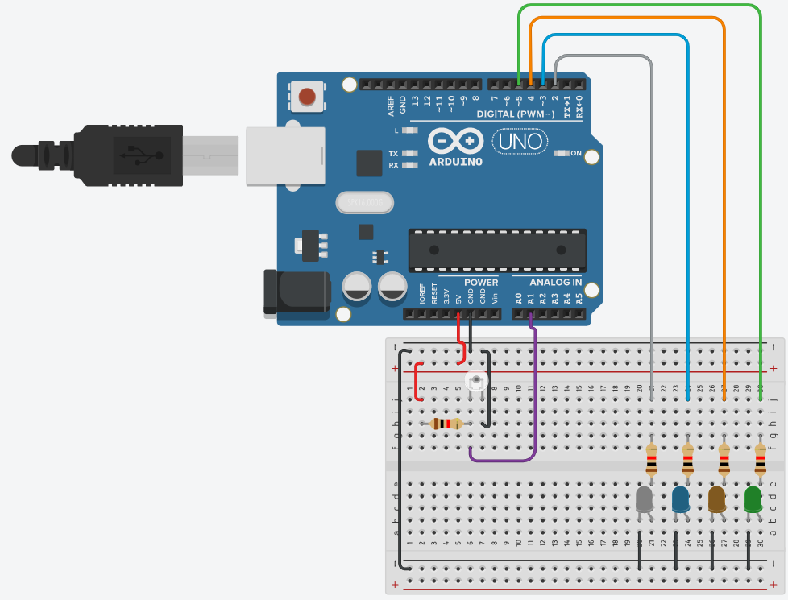

**Sensor de Distancia(HC-SR04)**
En el siguiente circuito se implemente un sensor de distancia ultrasónico que dependiendo a la distancia que se encuentre el objetivo se irán encendiendo o apagando los leds

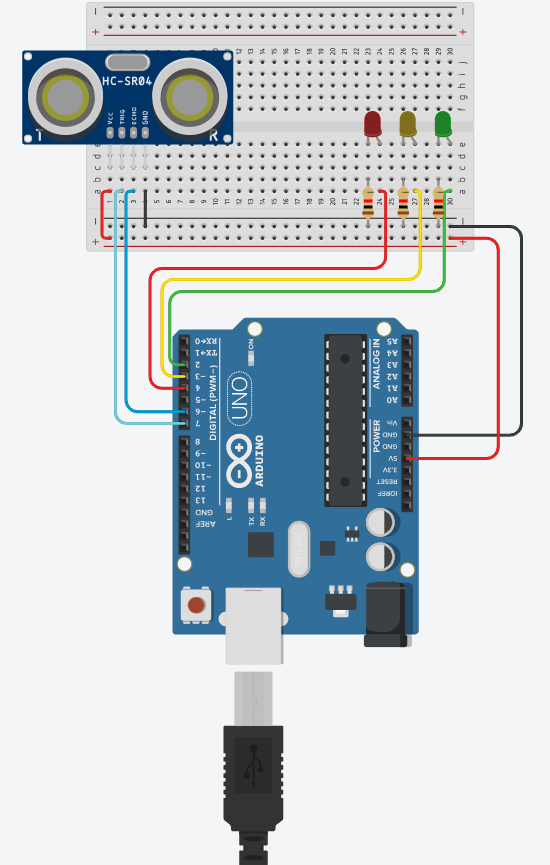

